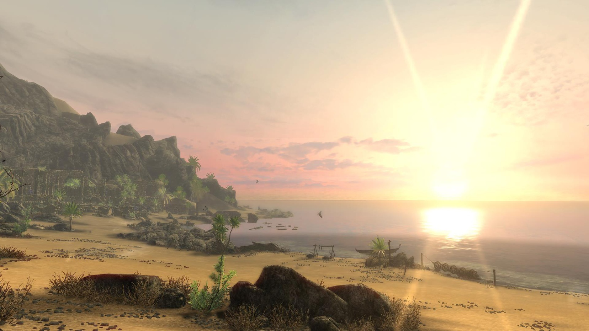

# Enderal - My Way

- [Enderal - My Way](#enderal---my-way)
- [Preamble](#preamble)
- [Installation](#installation)
  - [Pre-Installation](#pre-installation)
    - [Installing Microsoft Visual C++ Redistributable Package](#installing-microsoft-visual-c-redistributable-package)
    - [Steam Config](#steam-config)
      - [Install Enderal](#install-enderal)
      - [Disable the Steam Overlay](#disable-the-steam-overlay)
      - [Set the Game language to English](#set-the-game-language-to-english)
    - [Clean Enderal](#clean-enderal)
    - [Start Enderal](#start-enderal)
  - [Using Wabbajack](#using-wabbajack)
    - [Preparations](#preparations)
    - [Downloading and Installing](#downloading-and-installing)
      - [Problems with Wabbajack](#problems-with-wabbajack)
  - [Post-Installation](#post-installation)
    - [Copy Game Folder Files](#copy-game-folder-files)
  - [In-Game MCM Options](#in-game-mcm-options)
  - [Tweaking Performance](#tweaking-performance)
    - [ENB: Rudy for Enderal WIP](#enb-rudy-for-enderal-wip)
    - [Tweaking the ENB](#tweaking-the-enb)
    - [Tweaking the Game Settings](#tweaking-the-game-settings)
  - [Updating](#updating)
  - [Removing the Modlist](#removing-the-modlist)
- [Noteworthy Mods](#noteworthy-mods)
  - [Combat - Melee](#combat---melee)
  - [Combat - Magic](#combat---magic)
  - [Quest and Encounter Mods](#quest-and-encounter-mods)
  - [Creatures](#creatures)
- [FAQ](#faq)
- [Credits and Thanks](#credits-and-thanks)
- [Contact](#contact)
- [Contributing](#contributing)
- [Changelog](#changelog)

# Preamble

Enderal - My Way is a balanced but hardcore take on the Enderal game experience with upgraded environments, improved/replaced equippable appearances and better looking NPCs.

Various bug fixes have been made and quality of life features have been included.

The combat loop has been completely overhauled by Enderal Gameplay Overhaul and Combat Gameplay Overhaul with further balancing done specifically for this list.

Crossbows have been implemented to broaden the archery options available.

# Installation

## Pre-Installation

These steps are only needed if you install this Modlist for the first time. If you update the Modlist, jump straight to [Updating](#updating).

### Installing Microsoft Visual C++ Redistributable Package

I doubt you need to do this since you likely already have this installed. The package is required for MO2 and you can download it from [Microsoft](https://support.microsoft.com/en-us/help/2977003/the-latest-supported-visual-c-downloads). Download the x64 version under "Visual Studio 2015, 2017 and 2019". [Direct link](https://aka.ms/vs/16/release/vc_redist.x64.exe) if you can't find it.

### Steam Config

#### Install Enderal

Enderal is it's own seperate entry in your Steam library.  You need to install it just like you would install Classic or Special Edition.  I recommend installing onto a SSD drive if one is available.

#### Disable the Steam Overlay

The Steam Overlay can cause issues with ENB and is recommended to be turned off.

Open the Properties window (right click the game in your Library->Properties), navigate to the _General_ tab and un-tick the _Enable the Steam Overlay while in-game_ checkbox.

#### Set the Game language to English

Just do it. This entire Modlist is in English and 99% of all mods you will find are also in English. I highly recommend playing the game in English and **I will not give support to people with a non-English game**.

Open the Steam Properties window, navigate to the _Language_ tab and select _English_ from the dropdown menu.

### Clean Enderal

I highly recommend uninstalling the game through Steam, deleting the game folder and reinstalling it. You should also clean up the `Enderal` folder in `Documents/My Games/`.

### Start Enderal

After you have done everything above and got a clean Enderal installation ready, start the Launcher and open the _Options_ menu.

1. Click on _Settings_
1. Click on _Common_
2. Set the _Aspect Ratio_ and _Resolution_ to your monitor's native values
3. Set _Antialiasing_ to _Off_
4. Select _Borderless Fullscreen_ from the dropdown

Start the game and exit once you're in the main menu.

## Using Wabbajack

### Preparations

Grab the latest release of Wabbajack from [here](https://github.com/wabbajack-tools/wabbajack/releases) and place the `Wabbajack.exe` folder on the root of your drive such as `C:/Wabbajack`. This is your _working folder_ when the term is used again.

Let's get to the actual installation. Grab the latest release of `Enderal - My Way` from [the release tab](https://github.com/jdsmith2816/emw/releases) or by running Wabbajack and selecting Browse Modlists.

If Downloading From Browse Modlists

- After clicking Browse Modlists, scroll until you find `Enderal - My Way` and click the download modlist button, an arrow pointing down with a horizontal arrow. After downloading it will take you to a new screen to select `Download Location` and `Installation Location`.

If Downloading From Release Tab

- Download the release to a _working folder_. This folder **must not** be in a _common folder_ like your `Desktop`, `Downloads` or `Program Files` folder. It's best to create a Wabbajack folder near the root level of your drive like `C:/Wabbajack`.

### Downloading and Installing

The download and installation process can take a very long time depending on your system specs. Wabbajack will calculate the amount of threads it will use at the start of the installation. To have the highest amount of threads and thus the fastest speed, it is advised to have the working folder on an SSD.

1. Open Wabbajack
2. Load the Modlist from Disk by clicking `Install From Disk`
3. Adjust the download and installation paths
4. Click the Go/Begin button
5. Wait for Wabbajack to finish

The `Installation Location` must NOT be your Skyrim folder. Your `Download Location` by default will be a folder inside your `Installation Location`. Using the same `Download Location` for multiple lists will help prevent downloading mods shared by the lists multiple times but is not necessary.

#### Problems with Wabbajack

There are a lot of different scenarios where Wabbajack will produce an error. I recommend re-running Wabbajack before posting anything. Wabbajack will continue where it left off so you loose no progress.

**Could not download x**:

If a mod updated and the old files got deleted, it is impossible to download them. In this case just wait till I update the Modlist.

**x is not a whitelisted download**:

This can happen when I update the modlist. Check if a new update is available and wait if there is none.

**Wabbajack could not find my game folder**:

Wabbajack will not work with a pirated version of the game. If you own the game on Steam, go back to the [Pre-Installation](#pre-installation) step.

## Post-Installation

### Copy Game Folder Files

Inside of the folder that you chose to install EMW is a folder called `Game Folder Files`.  The _contents_ of this folder must be placed into the Enderal game directory.  If you chose to install EMW to `c:/MO2 - Enderal My Way` and your steam is located at `c:/steam` then the contents of `c:/MO2 - Enderal My Way/Game Folder Files/` would need to be copied into `c:/steam/steamapps/common/Enderal/` for instance.

## In-Game MCM Options

If an MCM page or a setting on an individual page is not listed then it is either already fully pre-configured by changes I have made or it does not need adjustment from it's default state.

    Legend
    [ ] - Unchecked checkbox
    [x] - Checked checkbox
    <Selected Option> - Dropdown with the `Selected Option` option selected

- All Geared Up Derivative
  - Misc - Player
    - Scroll - Disable
    - Horn - Disable
    - Elder Scroll - Disable
    - White Phial - Disable
    - Azura's Star - Disable
  - NPC
    - Horn - Disable

- CGO
  - Settings
    - Unlocked Grip
      - Input Type <HOTKEY(TAP)>
      - Sweeping 2H Hitboxes [ ]
      - NPCs Change Grip [ ]
      - Stationary Speed Boost 0%
    - Dual Wield Blocking
      - Hotkey M3 (Whatever you prefer...)
    - Unlocked Movement
      - Power Attacks (1st Person) [ ]
      - Power Attacks (3rd Person) [ ]
      - Power Attacks (NPCs) [ ]
    - Dodge Roll
      - Input Type <HOTKEY(TAP)>
      - NPCs Dodge [ ]
    - Leaning ***(Customize as you see fit)***
      - Lean Multiplier (1st Person) x0.50
      - Lean Multiplier (3rd Person) x0.75
    - Camera Noise - ***Customize as you see fit***
      - Camera Noise Mult (1st Person) - 1.00

- Enderal Tools
  - Enderal comes with alot of crazy collectible quests... This can help you track them with quests if you want.

- Equipment HUD
  - I find this tool to be extremely valuable for playing the game without having to dive into alot of mensu.  Everything in this section is optional and should be customized to your liking.
  
  - Cyclers
    - Left-hand cycler 1 - C
    - Power/shout cycler 1 - X
    - Right-hand cycler 1 - V
    - Add to cycler - + (plus)
    - Remove from Cycler - - (minus)
    - Shift cursor left - {
    - Shift cursor right - }

- Immersive HUD
  - Activation
    - iHUD hotkey - PgDn ***(Anything that's not X if using Equipment HUD)***

- Ultimate Combat
  - General
    - Timed Block
      - Effective Time 0.00S
    - Stagger
      - Enemy Poise [ ]
      - Player Stagger [ ]
      - NPC's Bow Poise *0.0
      - Player's Bow Poise * 0.0
  - NPC Setting
    - NPC
      - Dodge LOW
        - Step Dodge [X]
      - Giant
        - Max HP Scale MAXHP * 1.0
      - Dwarven Centurions
        - HP Mult HP*1.0
      - Dragon Priest
        - HP Mult HP*1.0

  - XPMSE
    - Quiver Style
      - PLAYER <FROSTFALL QUIVER (XP32)>
      - NON-PLAYER <FROSTFALL QUIVER (XP32)>

## Tweaking Performance

My Setup:

- Ryzen 3700x
- 1080ti
- 32GB DDR4-3200 RAM (CL 14)
- Game and MO2 running on a Samsung 970 EVO Plus M.2 NVME SSD

### ENB: Rudy for Enderal WIP

Rudy for Enderal WIP is Work In Progress update to the Enderal version of [Rudy ENB](https://www.nexusmods.com/skyrim/mods/41482). Rudy ENB for Enderal greatly increases visual fidelity but also alters the look of the game significantly.  If you want something lighter weight that sticks more to the vanilla Enderal feel then investigate [Vanilla Look ENB](https://www.nexusmods.com/enderal/mods/133?tab=files)

### Tweaking the ENB

This should always be the first thing you tweak. Disabling and ENB entirely can give you anything from 5 to >70 FPS depending on what you're using. The ENB this Modlist comes with (see [ENB: Rudy for Enderal WIP](#enb-rudy-for-enderal-wip)) is fairly intensivebut it can be toned down. Open the ENB GUI using `Right Shift + Enter` (`Right Shift` is under the `Enter` key). This will open up the ENB GUI where you can enable and disable certain effects in the left panel.

- `Bloom`: Can give you up to 3 FPS, will make light sources less bright
- `DepthOfField`: Can give you up to 10 FPS, disabled by default and not really suited for gameplay
- `Ambient Occlusion`: This one is a big hitter. You can get up to 20 FPS by disabling this but the effect is very noticeable
- `Distant/DetailedShadow`: Those two can really give you a lot of FPS back depending on your shader settings (game settings). They are very noticeable.
- `ComplexFire/ParticleLights`: You won't see a lot of difference at first when disabling those two, but when particles are on screen (eg using magic or near light sources such as fires), they can _burn_ through your FPS

### Tweaking the Game Settings

I highly recommend using [BethINI](https://www.nexusmods.com/skyrimspecialedition/mods/4875) which is included in this Modlist (can be found in `MO2/tools/BethINI`). I recommend tweaking the `Detail` section for more FPS:

- `Shadow Resolution`: Very big one. A good balance is `2048` which is the borderline between high FPS drainage and garbage looking shadows.
- `Ambient Occlusion`: Highly recommended to leave this at `None`. The ENB this Modlist comes with, uses the ENB SAO which is 10x better than base game SAO.
- `Detailed Draw Distance`: Maybe try `2000` instead of `2800` but you won't notice a lot of FPS gain (maybe 1-3)
- `Remove Shadows`: If you really struggle, use this. This will disable all Shadows (not recommended)

## Updating

If this Modlist receives an update please check the Changelog before doing anything. Always backup your saves or start a new game after updating.

**Wabbajack will delete all files that are not part of the Modlist when updating!**

This means that any additional mods you have installed on top of the Modlist will be deleted. Your downloads folder will not be touched!

Updating is like installing. You only have to make sure that you select the same path and tick the _overwrite existing Modlist_ button.

## Removing the Modlist

You can just remove the MO2 folder and be done with it. SKSE and ENB files will still be in your game folder so I recommend using [ENB and ReShade Manager](https://www.nexusmods.com/skyrimspecialedition/mods/4143) if you want to remove the ENB.

# Noteworthy Mods

[Enderal Gameplay Overhaul](https://www.nexusmods.com/enderal/mods/116) is a complete overhaul of the gameplay mechanics of Enderal. This includes a ton of balance changes, improvements to the ai, new gameplay mechanics, new weapons/spells/potions and much more.

## Combat - Melee

[Combat Gameplay Overhaul](https://www.nexusmods.com/skyrim/mods/100904) adds several features and fixes to combat and movement. It has responsive dodge rolls, procedural leaning, grip changing, mid-air combat, striking with staffs, dual-wielding two-handed weapons, 1st & 3rd person weapon animations, and more.

[Ultimate Combat](https://www.nexusmods.com/skyrim/mods/36006) is utilized for better enemy ai and localized damage for bows. All other features are disabled to allow EGO and CGO to shine.

## Combat - Magic

[ENDERAL - KataPUMB Spell Package](https://www.nexusmods.com/skyrim/mods/96908) adds forty New Spells, two new armor sets and books made like shields.

[The Forbidden Arts](https://www.nexusmods.com/enderal/mods/105) seeks to add more depth and complexity to Necromancy in Enderal. It prevents reanimated thralls from turning to ashpiles upon death, adds a new perk that extends the duration of reanimation spells, gives you the ability to interact and customize your reanimated thralls, teaches a new spell to summon them and more.

## Quest and Encounter Mods

[Disenchanted](https://www.nexusmods.com/enderal/mods/145) adds a quest in Riverville related to strange noises coming from the Old Tunnel near town.

[Fire of the Mountain](https://www.nexusmods.com/enderal/mods/125)

## Creatures

[Old Arps](https://www.nexusmods.com/enderal/mods/85) reverts the appearance of Arps to before SureAI turned them into Falmer.

[Pets of Enderal](https://www.nexusmods.com/enderal/mods/77) adds... pets... to Enderal.

[Restored Vatyr Variants](https://www.nexusmods.com/enderal/mods/152) restores the removed Vatyr variants.

# FAQ

- I'm a 21:9 resolution user and my screen looks weird
  - Search 21x9 in mod organizer and activate all of those mods.
- I have weird gaps in my armor?!?
  - The price we pay for amazing armor sets is that they are pretty much exclusive.  If you start mixing and matching them you will wind up with strange gaps and such.
  - The helmets are gender based but only the females drop.  Take your set helmet to a forge and turn it into the male part at no cost if you need one.
  - A few of the sets have additional pieces that are needed to round out their look.  These can be crafted at the forge for no cost.  They give no stats and cannot be enchanted.
- I failed to download some files?!!?
  - Download any failures manually and place in the downloads folder before continuing
    - [9204 Bless MD0101](https://drive.google.com/uc?id=1NViMFoqkmVVRQA77vYj4NBDTho8gq8Ik&export=download)
    - [9204 BO HV0201M](https://drive.google.com/uc?id=1zkI2xduR4tVX45NkZI3Pt_6X_UM5zRWe&export=download)
    - [9204 MBO 0006](https://drive.google.com/uc?id=16AeP543vWxaSuX9aRTVfpGhYZQ_z5XTW&export=download)
    - [9204 MBO 0010](https://drive.google.com/uc?id=1d5QuAHsX8np_k-cmNbOqrp-elyOoa7Hk&export=download)
    - [9204 MBO 0016](https://drive.google.com/uc?id=1iMTi114vUM1XWvxseaIHIeK35CFDeW5y&export=download)
    - [9204 MBO 0027](https://drive.google.com/uc?id=1TCePH7SsBu2kY3d77HaCFmCFw1ZQ9L1K&export=download)
    - [BDO Complete Pack](https://mega.nz/file/cegTSARa#xJTZGpnoZR1DlJMXMIh7FpU8y0JOhWQuPqsIqLEzzwA)
    - [DM BDOR Gierach](https://drive.google.com/uc?id=1sn6lFJEnpibT7twHjXUDu6CknTQD6V58&export=download)
    - [DM BDOR Lemoria](https://drive.google.com/uc?id=1PCW3QlbkMt-ybH_KecY3r80QxpILqR-8&export=download)
    - [DM BDOR Mueburus](https://drive.google.com/uc?id=1iy7AywzXE9FNI3eBB1p92fgW-dgF3Xm1&export=download)
    - [DM Bless HV0102](https://drive.google.com/uc?id=1ndLb2pZA4tmNYEoUa-jS3YBc-SqZE12c&export=download)
    - [DM Bless MS0102](https://drive.google.com/uc?id=1ouzM9Ie73h1AjWGCSFdqDe1-a8peZhjs&export=download)
    - [BDOR Pack](https://drive.google.com/uc?id=1jZAHOiBqZnSFbinpX-yPRmcwHS1D6b4s&export=download)

# Credits and Thanks

- _YOU_ for actually reading the readme. Thanks a ton!!
- Total for help with the Set overhaul and balance updates.
- Lotus by erri120 - Repository template
- Halgari and everyone the WJ Team - Wabbajack is awesome and so are they

# Contact

While I'm always available on the [Wabbajack Discord](https://discord.gg/wabbajack), I would advise checking the [Issues](https://github.com/jdsmith2816/emw/issues) (open **and** closed ones) on GitHub first if you have any problems. The same goes for _Enhancements_ or _Feature/Mod Requests_. **DO NOT DM ME ON DISCORD. I WILL NOT PROVIDE SUPPORT FOR YOU IN DMS AND I WILL BLOCK YOU**.

# Contributing

See [Contributing](CONTRIBUTING.md).

# Changelog

See [Changelog](CHANGELOG.md).
